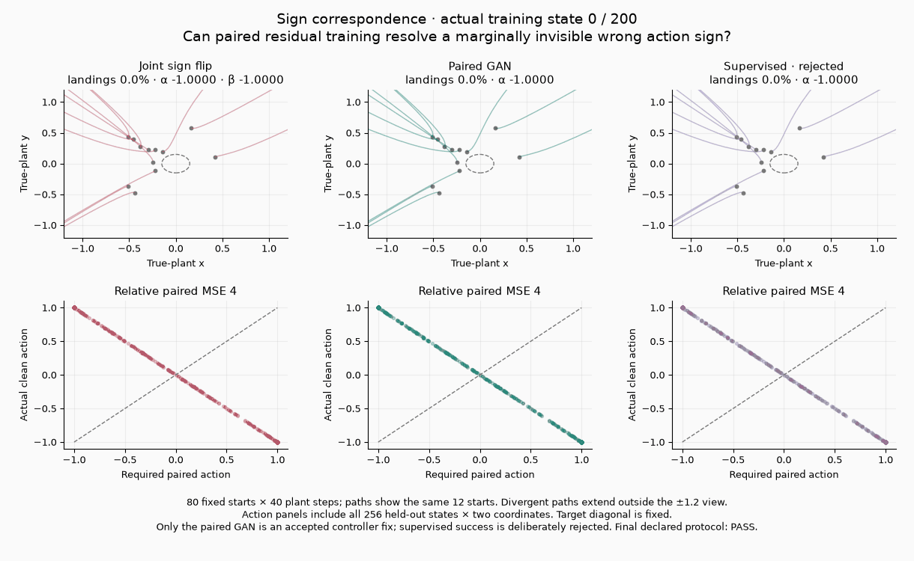
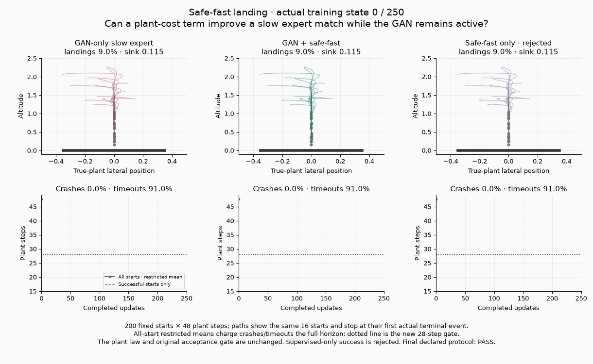
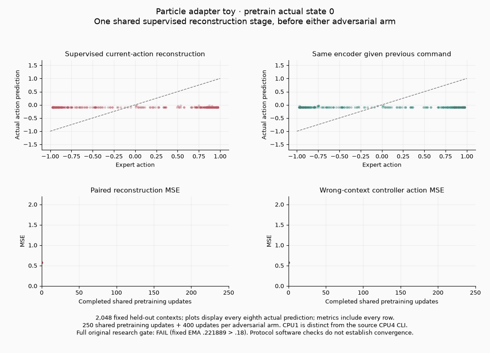

# Fresh training coverage for three source-reviewed families

Two original diagnostics pass and one fails on the new, fixed **CPU1** cohort.
Each family ran once from exact develop
`6ec7e5788e14ea15ddc3e16ac71110458108b6a6` source, with its original seed,
initialization, recipe, input law, update budget and scientific gate. This adds
training evidence to `source-family-11/12/13`; it does not rewrite the original
audit's `SOURCE REVIEW ONLY` snapshot. No solver, library or config was changed.
These original loops call recipe optimizer/penalty APIs; they do not run the
complete Atlas/E22Policy lifecycle. Converting them would create a different
formulation cohort, so these results carry no Atlas qualification credit.

| Family | Original diagnostic | Added versioned gate | What this actually verifies |
|---|---|---|---|
| 11 · sign correspondence | **PASS** | Paired-action gate **PASS** | A symmetric state/action joint law cannot identify a wrong sign; paired residual training recovers the correct action on a fixed point plant. |
| 12 · safe-fast landing | **PASS** | All-start landing gate **PASS** | A differentiable plant cost improves a deliberately slow expert match while measured GAN gradients remain active. |
| 13 · native latent joint | **FAIL** | Paired-action gate **FAIL**, live and EMA | The complete scoped latent-joint configuration improves row correspondence, but misses the declared fixed-budget accuracy threshold on this runtime. |

The three GIFs contain **11, 13 and 19 actual recorded training states**,
respectively. They use real observed gains, clean action predictions and
true-plant rollouts, with fixed evaluation inputs. There is no interpolation,
reconstructed endpoint animation or selected-seed retry. Full metrics score all
evaluation rows; plotting subsamples are explicitly labelled.

## 11: sign correspondence in a symmetric point plant



The expert is an odd clipped PD law on position/velocity. Therefore the
transformation `(state, action) → (-state, -action)` preserves the target joint
distribution, although applying that action to the true state drives the plant
away from the pad. The collapsed arm trains both input sign β and action sign
α. The accepted paired arm trains α through the normalized residual game;
the supervised α-only arm is an explicitly rejected objective control.

At the original **200 updates per arm**:

| Arm | α | β | Landings | Relative paired action MSE | Accepted objective |
|---|---:|---:|---:|---:|---|
| Joint marginal game | -0.966116 | -0.954082 | 0% | 3.865612 | No: correspondence fails |
| Paired residual GAN | 1.004132 | — | 100% | 0.000004023 | Yes |
| Supervised-only control | 1.000000 | — | 100% | 0.0000000000000326 | No: adversarial weight zero |

The paired GAN applies the recipe penalty **200 times** and accumulates a
nonzero GAN gradient. The original gate also requires the marginal arm to fail
and the supervised-only arm to be rejected; all terms pass. The separate
`toy-definition-quality-v1` correspondence metric uses the same 256 held-out
states and zero-action neutral witness. Its relative-MSE threshold is `.10`;
the original paired gate is tighter at `.05` and also requires ≥95% landings.
Both pass here. The GIF uses 80 fixed starts over 40 plant steps and shows the
same 12 paths; it also shows every held-out paired action.

This is a scalar sign-identifiability diagnostic. It does not run YuE2 audio,
learn a complex controller network or qualify a Lunar Lander policy. Its useful
scientific claim is the correspondence failure of a symmetry-preserving joint
objective and recovery under the prescribed paired game.

## 12: safe-fast landing without turning off the adversary



The source's four-coordinate plant has altitude, lateral position and two
velocities. A single learned gain sets sink rate. Baseline GAN training matches
a slow expert; the combined arm retains the GAN and adds time/crash/soft-contact
cost. The supervised-only cost arm is rejected even when its landings succeed.

At the original **250 updates per arm**, all three use the same 200 fixed
evaluation starts and 48-step horizon:

| Arm | Sink | Landings | Crashes | Timeouts | Mean successful steps | All-start restricted mean |
|---|---:|---:|---:|---:|---:|---:|
| GAN-only slow expert | 0.100653 | 1.5% | 0% | 98.5% | 46.000 | 47.970 |
| GAN + safe-fast | 0.457974 | 100% | 0% | 0% | 21.985 | 21.985 |
| Cost-only, rejected | 0.527469 | 100% | 0% | 0% | 19.890 | 19.890 |

The combined arm accumulates **218.192** absolute GAN gradient and **245.092**
absolute cost gradient; its mean late GAN gradient is **0.924765**, above the
original `.2` threshold. It applies the recipe penalty 250 times. The original
quality gap, safe-sink, live-gradient, reference-policy and objective-rejection
terms all pass.

The added all-start gate charges crashes and timeouts the complete horizon,
rather than scoring time only among successful starts. It requires landings
≥95%, crashes ≤2%, timeouts ≤3% and restricted mean ≤28 steps. The combined
arm passes this stronger denominator check. The same target cohort explains
why its original and restricted means coincide. The GIF shows the same 16
actual paths, truncated for display at their first true terminal event.

This verifies a plant-cost tradeoff for one scalar sink gain. It does not prove
the GAN improves the shaping-only control: that control is faster here and is
rejected solely because it omits the required adversarial objective. It is not
a full learned Lunar Lander or general-purpose safety result.

## 13: latent-joint adapter improves but fails its accuracy gate



The source first runs **250 shared reconstruction updates**. The expert action
is `tanh(-2.2 × previous command)`; state is independently present in the record.
The control encoder initially receives the previous command where the paired
encoder had received current action. Both adversarial arms start from that same
prepared host and run their original **400 finetuning updates**.

The current arm uses observation critics and trains all owners. The fixed arm
uses a live `(record, latent)` joint critic and trains only the control encoder
and action head. Therefore this is a complete configuration comparison; it
does not isolate critic conditioning from ownership as the sole cause.

| Final arm | Live action MSE | EMA action MSE | EMA relative MSE vs zero-action neutral |
|---|---:|---:|---:|
| Current observation game | 1.988992 | 1.531759 | 2.702256 |
| Fixed latent joint | 0.214156 | **0.221889** | **0.391445** |

The exact original acceptance terms are:

- Current EMA ≥1.0: **PASS**, at 1.531759.
- Fixed EMA <25% of current EMA: **PASS**, since 0.221889 <0.382940.
- Fixed EMA ≤0.18: **FAIL**, by **0.041889** (23.3% above the ceiling).

This final absolute accuracy shortfall is the sole failing original numerical
gate term. The fixed arm improves EMA MSE about **85.5%** over current, but the
original budget does not earn its declared convergence acceptance. Live MSE
also exceeds `.18`, so EMA lag alone cannot explain the failure. The recorded
live values oscillate: `.198083` at150, `.557024` at200, `.205098` at350 and
`.214156` at400. These observations identify incomplete accuracy and unstable
progress; they do not identify a unique causal solver defect. No retry, budget
extension or rate/config adjustment was made.

The additional normalized paired gate requires relative MSE ≤`.10`. For this
fixed 2,048-row panel the neutral MSE is `.566845`, so its absolute equivalent
is `.056684`. Both fixed live and EMA outputs fail this separate stricter gate.
The original MSE ceiling and this added normalized criterion retain distinct
identities; neither is weakened or replaced by protocol software passing.

The source CLI hardcodes four threads. This run calls its existing `pretrain`,
`run_arm` and `gate_status` functions in the same order, on explicitly recorded
CPU1. The source's historical convergence test is optional because identical
fixed-input training has passed and failed across supported CI CPUs. This is
a fresh CPU1 result, not a relabelled CPU4 result or a claim that the software
protocol tests establish learned convergence.

## Observation purity, trajectory parity and provenance

All **102 actual training-state observations** preserve the directly held model,
gradient, optimizer, mode and RNG state. Captured scalar final metrics exactly
match the untouched original functions. Native observations match **all 18
original scheduled metric rows**, including both live and EMA values (36 scalar
comparisons). Its added early snapshots remain separate from the source's
scheduled series/maxima.

A separate software-prefix validation compares observations against a baseline
that records only state hashes. It covers **nine source stages/arms × four
boundaries (0,1,2,3) =36 exact complete owner-state matches**, including every
optimizer held in lists/dictionaries, gradients, module modes and global/local
RNG streams. Both paths stop externally before update4, leaving source update
budgets and recipe definitions intact. These **54 software updates** and their
three-update native host supply observation-parity evidence, not an additional
qualified model. Full scientific campaigns were not rerun to validate capture.

Each scientific worker had an enforced **120-second wall cap**. Training plus
observation took 5.42s / 40.95s / 29.55s for sign / landing / native, respectively.
Prefix parity took 12.89s in total. Shared machine timing is not a speed ranking.
Execution uses Python3.12.13, Torch2.13.0+cu126, CPU1 and `MKL_CBWR=AVX2`.

The [compact coverage receipt](coverage.json) has a `records` list with
`catalog_id`, `original_scientific_status`, separate `added_gate_status` and
`media` fields. It binds source/package/evaluator/observer identities, original
gates, resolved recipes, final metrics and raw archive hashes. The
[media receipt](media/media.json) binds all 43 GIF frames to exact observed
tensor data. Bulk JSONL, tensors, stdout and prefix traces remain under
`/ml2/hypergan/toy-source-family-training-20261001`, outside Git.

Reproduce from an isolated pristine checkout of the pinned source revision.
Use a copy of the versioned `definition_quality.py` evaluator and fresh artifact
directories; scientific source files must match Git before training starts:

```sh
CUDA_VISIBLE_DEVICES='' OMP_NUM_THREADS=1 MKL_NUM_THREADS=1 \
OPENBLAS_NUM_THREADS=1 MKL_CBWR=AVX2 python -m benchmarks.toy_audit.source_family_training \
    --source /path/to/pristine-develop-6ec7 \
    --family sign \
    --quality /path/to/frozen/definition_quality.py \
    --out /path/to/local-artifacts/sign
```

Run the same command with `--family landing` and `--family native`, each with
its own fresh output. Then render the three actual observation archives:

```sh
MPLCONFIGDIR=/tmp/toy-source-matplotlib \
python -m benchmarks.toy_audit.render_source_families \
    --artifacts /path/to/local-artifacts \
    --out /path/to/training-gifs
```

The distinct short software-prefix parity command is:

```sh
CUDA_VISIBLE_DEVICES='' OMP_NUM_THREADS=1 MKL_NUM_THREADS=1 \
OPENBLAS_NUM_THREADS=1 MKL_CBWR=AVX2 python -m benchmarks.toy_audit.check_source_family_parity \
    --source /path/to/pristine-develop-6ec7 \
    --quality /path/to/frozen/definition_quality.py \
    --out /path/to/local-artifacts/prefix-parity
```
