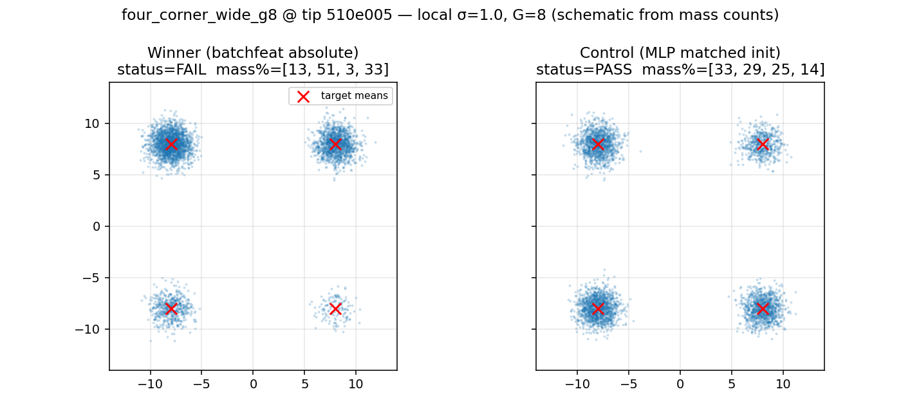

# Four-corner wide-gap square: local (unscaled) width

Does **not** claim a new formulation champion. Tip `gan_v3` / shared_c6 with the
published batchfeat distance-head witness still owns the native-scale unadjusted board.

## Principal

Classic wrong-lengthscale / mode-imbalance stress: four isotropic islands on a square
lattice at `(±8, ±8)` with nearest-neighbor gap matching `wide_gap_islands_x8` (`d=16`)
while **local** width stays moderate (`σ=1.0`). Distinct from:

- `wide_gap_islands_x8` (only two islands on a line)
- `three_island_wide_d16` (three equilateral vertices)
- `eight_ring_wide_r8` (eight close circular neighbors; tip passed)
- `square_gauge_x24` (isotropic scale of means *and* covariances)

- Winner: published absolute kernels `[0.1, 0.25, 0.5, 1.0]` + `init_std=0.5`
- Control: lengthscale-free SimpleMLP with matched `init_std≈5.657` (origin→corner reach)

## Result (tip `510e005`, MKL_CBWR=AVX2, OMP/MKL threads=1)

| Arm | D | init_std | Live | Suffix | mass% | sw1 |
| --- | --- | ---: | --- | ---: | --- | ---: |
| Winner (published absolute) | batchfeat distance-head | 0.5 | **FAIL** | 0 | ~13/51/3/33 | 0.372 |
| Control (MLP + matched init) | SimpleMLP default | 5.657 | **PASS** | 15 | ~33/29/25/14 | 0.121 |



## Reproduce

```bash
MKL_CBWR=AVX2 OMP_NUM_THREADS=1 MKL_NUM_THREADS=1 \
  PYTHONPATH=. python -u reports/transfer_suite/four_corner_wide_g8/reproduce_arms.py
```
