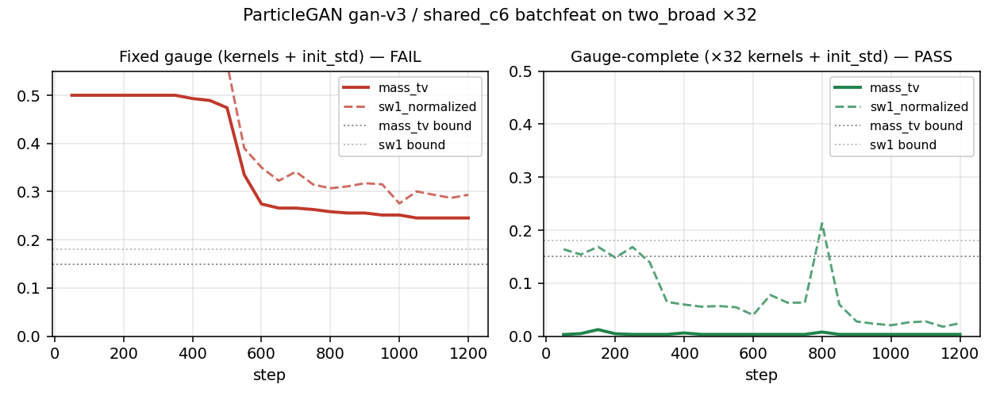

# Gauge-covariant ×32 transfer of BatchDistanceDiscriminator

Does **not** claim a new formulation champion. Tip `gan_v3` / shared_c6 with the
published batchfeat distance-head witness still owns the unadjusted 19/19 on the
native-scale board.

## Principal

`BatchDistanceDiscriminator` documents that kernel `scales` are in input
coordinate units, and the vector host hardcodes `ParticlePrior(..., init_std=.5)`.
A stationary isotropic unit change of easy `vector_two_broad` (means×32,
cov×1024) must be matched by **every** absolute length — kernels **and** particle
init — not by the recipe alone.

Prior soft probes: pure ×20 PASS/PASS; pure ×40 FAIL/FAIL (including default MLP);
kernel-only gauges also FAIL. This run asks for a **fair** fail at ×32.

## Result (seed-0, MKL_CBWR=AVX2, OMP/MKL threads=1)

| Arm | Kernels | init_std | Live | Suffix | mass_tv | sw1 |
| --- | --- | ---: | --- | ---: | ---: | ---: |
| Winner (published gauge) | (.1,.25,.5,1) | 0.5 | **FAIL** | 0 | 0.245 | 0.294 |
| Control (gauge-complete) | ×32 | 16.0 | **PASS** | 8 | 0.003 | 0.024 |

Winner collapses toward one mode (~75/25 mass). Control recovers balanced modes
under the same shared_c6 recipe and the same batchfeat trunk.



## Reproduce

```bash
cd <ParticleGAN checkout>
MKL_CBWR=AVX2 OMP_NUM_THREADS=1 MKL_NUM_THREADS=1 \
  python -u reports/transfer_suite/gauge_covariant_x32/reproduce_arms.py
```

Evidence: `index.json`, per-arm `*.summary.json` / `*.json.gz`, tip SHA recorded
in the PR body.
