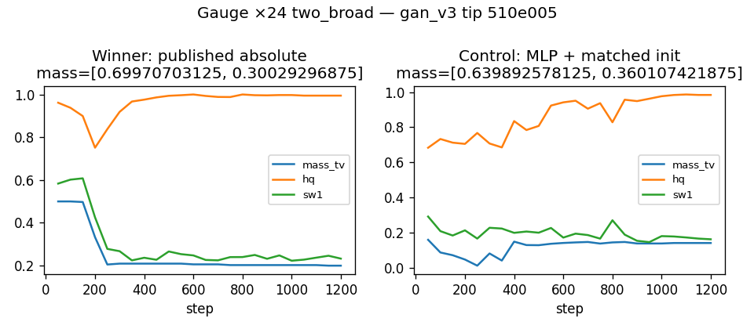

# Gauge ×24 two_broad: published absolute lengths vs lengthscale-free MLP

Does **not** claim a new formulation champion. Tip `gan_v3` / shared_c6 with the
published batchfeat distance-head witness still owns the native-scale unadjusted 19/19.

## Principal

Distinct from the gauge-complete batchfeat control in PR #45. Here the control
drops absolute RBF lengths entirely: SimpleMLP under the same shared_c6 recipe
with only ParticlePrior `init_std` matched to the unit change.

Published host pairing keeps kernel scales `(.1,.25,.5,1)` and `init_std=.5`.

## Result (tip `510e005`, MKL_CBWR=AVX2, OMP/MKL threads=1)

| Arm | D | init_std | Live | Suffix | mass | sw1 |
| --- | --- | ---: | --- | ---: | --- | ---: |
| Winner (published absolute) | batchfeat distance-head | 0.5 | **FAIL** | 0 | ~70/30 | 0.233 |
| Control (MLP + matched init) | SimpleMLP default | 12.0 | **PASS** | 7 | balanced enough | 0.161 |



## Reproduce

```bash
MKL_CBWR=AVX2 OMP_NUM_THREADS=1 MKL_NUM_THREADS=1 \
  python -u reports/transfer_suite/gauge_x24_mlp_control/reproduce_arms.py
```
