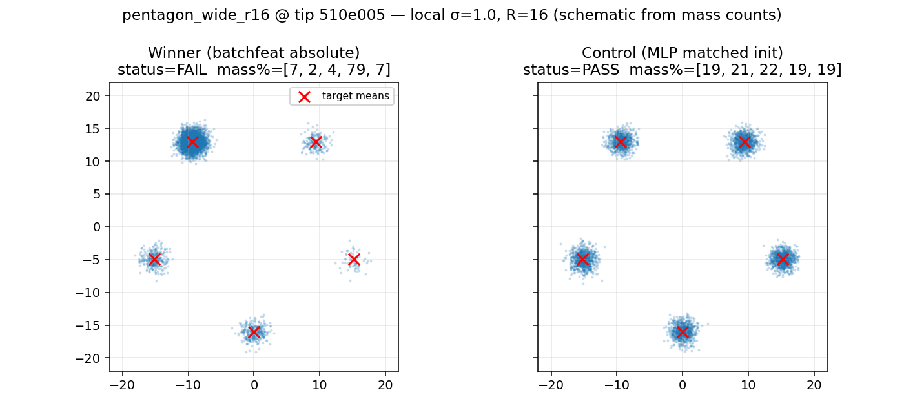

# Pentagon-wide lattice: distant modes, local (unscaled) width

Does **not** claim a new formulation champion. Tip `gan_v3` / shared_c6 with the
published batchfeat distance-head witness still owns the native-scale unadjusted board.

## Principal

Classic wrong-lengthscale / mode-covering stress on the next lattice after the
2/3/4/6 wide-gap hits: five isotropic islands on a regular pentagon with
`circumradius = 16` (chord ~18.8) and **unscaled** local width `σ=1.0`.

- Winner: published absolute kernels `[0.1, 0.25, 0.5, 1.0]` + `init_std=0.5`
- Control: lengthscale-free SimpleMLP with matched `init_std=8.0`

Distinct from `hex_wide_side16` (6), `four_corner_wide_g8` (4),
`three_island_wide_d16` (3), and `eight_ring_wide_r8`.

## Result (tip `510e005`, MKL_CBWR=AVX2, OMP/MKL threads=1)

| Arm | D | init_std | Live | Suffix | mass% | sw1 |
| --- | --- | ---: | --- | ---: | --- | ---: |
| Winner (published absolute) | batchfeat distance-head | 0.5 | **FAIL** | 0 | ~7/2/4/79/7 | 0.581 |
| Control (MLP + matched init) | SimpleMLP default | 8.0 | **PASS** | 7 | ~19/21/22/19/19 | 0.025 |



## Reproduce

```bash
MKL_CBWR=AVX2 OMP_NUM_THREADS=1 MKL_NUM_THREADS=1 \
  PYTHONPATH=. python -u reports/transfer_suite/pentagon_wide_r16/reproduce_arms.py
```
