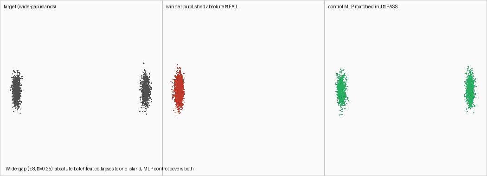

# Wide-gap islands: distant modes, local (unscaled) width

Does **not** claim a new formulation champion. Tip `gan_v3` / shared_c6 with the
published batchfeat distance-head witness still owns the native-scale unadjusted board.

## Principal

Classic wrong-lengthscale / mode-seeking stress: two isotropic islands at `±8` whose
**local** width stays at the suite default (`σ=0.25`). Distinct from pure gauge
transforms (#45/#47), which scale means *and* covariances together.

- Winner: published absolute kernels `[0.1, 0.25, 0.5, 1.0]` + `init_std=0.5`
- Control: lengthscale-free SimpleMLP with matched `init_std=4.0`

## Result (tip `510e005`, MKL_CBWR=AVX2, OMP/MKL threads=1)

| Arm | D | init_std | Live | Suffix | mass | sw1 |
| --- | --- | ---: | --- | ---: | --- | ---: |
| Winner (published absolute) | batchfeat distance-head | 0.5 | **FAIL** | 0 | 100/0 collapse | 0.625 |
| Control (MLP + matched init) | SimpleMLP default | 4.0 | **PASS** | 9 | ~54/46 | 0.062 |



## Reproduce

```bash
MKL_CBWR=AVX2 OMP_NUM_THREADS=1 MKL_NUM_THREADS=1 \
  PYTHONPATH=. python -u reports/transfer_suite/wide_gap_islands_x8/reproduce_arms.py
```
