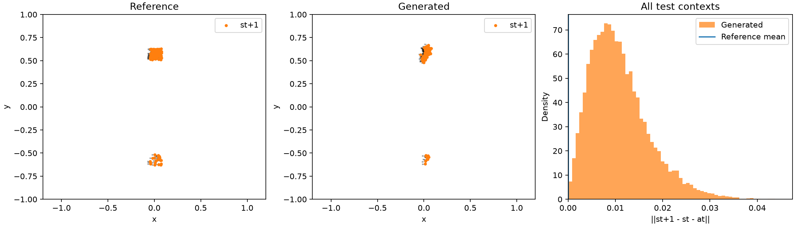

# Single-transition GAN results

G1 -> st; G2 -> at; G3 -> st+1. All three receive the same z and context. One joint D(st, at, st+1) supplies feedback. Action is displacement.

Matched 7,000 updates, 3,584,000 real training draws, seed 24002. Default public GAN recipe with UCD and z_dim=32. Training draws, initial D/prior, normalization, source hashes and evaluation settings are matched. Generator initializations differ with architecture. No seed-only repeats.

Lower SW1 and residual are better. Distances use frozen training normalization; residuals are in physical coordinates. Ranking is by aggregate held-out joint SW1.

| Model | G parameters | Test joint SW1 | Interp. | Extrap. | State SW1 | Action SW1 | Next SW1 | Residual mean / p95 | Train seconds |
|---|---:|---:|---:|---:|---:|---:|---:|---:|---:|
| monolithic | 65,526 | 0.0842 | 0.0681 | 0.1327 | 0.0731 | 0.1114 | 0.0735 | 0.01088 / 0.02290 | 54.1 |
| branches | 65,286 | 0.2535 | 0.2452 | 0.2783 | 0.2501 | 0.2404 | 0.2488 | 0.02596 / 0.05260 | 60.7 |

Real-vs-real floor: joint SW1 **0.0379**, residual **0**. Shuffling reference branches within context preserves all three empirical marginals but raises joint SW1 to **0.1513** and residual to **0.20478**. The mean reference displacement is **0.03656**, giving a physical scale for the residual.

| Model | Coverage | Precision | Spread ratio | Shuffled generated joint SW1 | Shuffled generated residual |
|---|---:|---:|---:|---:|---:|
| monolithic | 0.267 | 0.237 | 0.953 | 0.1665 | 0.19807 |
| branches | 0.209 | 0.189 | 1.116 | 0.3168 | 0.25227 |

Reference coverage/precision/spread: 0.954 / 0.948 / 1.015. Coverage is the fraction of reference points with a generated neighbor inside the reference's 95th-percentile nearest-neighbor radius; precision reverses the direction. This is a strict six-dimensional support check. Spread is total conditional normalized variance divided by reference variance, target 1.

## Interpretation

**monolithic** has the lowest held-out joint SW1 in this comparison. Use residual and support coverage alongside that rank: good marginal distances or total variance do not establish a physically coherent transition.

For **monolithic**, shuffling raises joint SW1 from 0.0842 to 0.1665 and residual from 0.01088 to 0.19807. The unshuffled residual is 29.8% of the mean reference step length. This ratio compares aggregate means, rather than averaging per-sample ratios.

For **branches**, shuffling raises joint SW1 from 0.2535 to 0.3168 and residual from 0.02596 to 0.25227. The unshuffled residual is 71.0% of the mean reference step length. This ratio compares aggregate means, rather than averaging per-sample ratios.

The monolithic generator wins on both joint distance and consistency. The three branches coordinate, but there is no evidence of an advantage from separating their parameters in this run. Shared intermediate features could make the relation easier to represent; that explanation is a hypothesis, not something this two-arm comparison isolates.

This tests learning the joint transition distribution from complete records. It does not yet test missing-data recovery, benefit over marginal-only training, or arbitrary state/action queries and rollouts.

## Recommendation

Keep the better joint sampler as the reference. Next, add a marginal-only baseline to test the motivating claim that learning the whole helps a part; compare its per-block distances and shuffled controls under a matched total budget. Resolve the remaining marginal/support errors before interpreting added marginal critics or missing observations. A better total variance ratio alone is insufficient.

## Visuals

Plots can be regenerated from saved samples without retraining. The separate render provenance records display-code revisions; training source archives stay unchanged.

[monolithic interactive viewer](monolithic_viewer.html)

[branches interactive viewer](branches_viewer.html)

