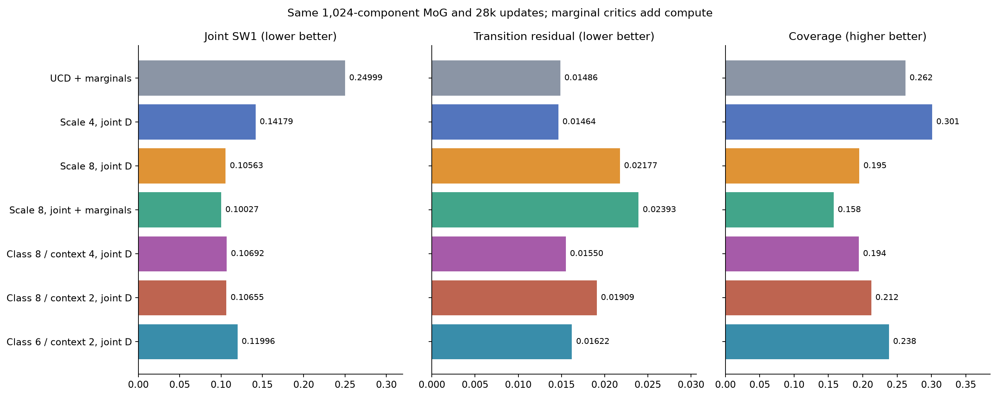

# Stronger conditioning and marginal critics

The new best joint SW1 is **0.10027**, a **29.3% reduction** from the previous
0.14179 leader and 59.9% from the original 0.24999 MoG baseline. However, physical
consistency and joint support coverage worsen. The score leader is not an
improvement on every diagnostic.

Both new experiments retain 1,024 MoG components, bcap, 28,000 updates, batch 256,
seed 24002, identical reference observations and 65,286 generator parameters:

```text
G1 -> st
G2 -> at
G3 -> st+1
```

Each independent G receives the same noisy z and observed class, geometry and
time. G3 remains independently predicted, with no physics loss or forced identity.

| Setup | Joint SW1 ↓ | Residual ↓ | Coverage ↑ | Upper class 0 / 1 | Train seconds |
|---|---:|---:|---:|---:|---:|
| Scale 8, joint + marginal Ds | **0.10027** | 0.02393 | 0.158 | 0.882 / 0.309 | 565.1 |
| Scale 8, joint D | 0.10563 | 0.02177 | 0.195 | 0.872 / 0.324 | 283.1 |
| Previous leader: scale 4, joint D | 0.14179 | **0.01464** | **0.301** | 0.826 / 0.485 | 318.2 |
| Original UCD + marginals | 0.24999 | 0.01486 | 0.262 | 0.577 / 0.571 | 609.6 |

Reference SW1 floor: 0.03788. Reference coverage: about 0.954. Analytic upper-route
targets: 0.8 / 0.3. GPUs had unrelated workloads during this round; wall time is
recorded but is not a controlled throughput comparison.



## What changed and what it means

1. **Class scale 4 -> 8, joint D unchanged.** Joint SW1 improves 25.5%. The only
   resolved configuration changes are class scale and output directory. Class 1's
   upper frequency moves from 0.485 to 0.324, while class 0 overshoots its target.
   Across all evaluated contexts, class 1 SW1 improves from 0.19946 to 0.09340;
   class 0 worsens from 0.08412 to 0.11785. Positive input scaling can be absorbed
   by the first layer's weights, so this changes initialization and optimization,
   not the representable function family or available information.
2. **Add marginal Ds at scale 8.** Retain `D(st, at, st+1)` and add separate
   `D(st)`, `D(at)` and `D(st+1)`, all conditioned on observed context. G receives
   the joint loss plus the mean marginal loss, with weight 1. D parameters rise
   from 135,169 to 238,084. SW1 improves another 5.1%, and all marginal SW1 scores
   improve modestly. Class 1 SW1 falls to 0.08275; class 0 stays near 0.11779.
   This did not recover joint support coverage or overall held-out consistency.

The scale-8 marginal model's state/action/next SW1 is 0.08385 / 0.11447 / 0.09351.
Interpolation/extrapolation joint SW1 is 0.08008 / 0.16084. Training residual is
0.00578, versus 0.02393 on held-out geometries. Its mean held-out residual is about
65% of the 0.03656 mean reference step length; p95 residual is 0.05279. Extrapolation
coverage is only 0.00020. The extra critics improve training coverage to 0.689,
but held-out coverage falls to 0.158. That gap deserves more attention than a
small additional SW1 gain.

Shuffling generated blocks within context raises the marginal model's joint SW1
to 0.16753 and residual to 0.17900. The branches learned useful coordination, but
the joint fit remains inaccurate. Marginal critics cannot directly check the
relationship between separate outputs; the joint critic supplies that feedback.

## Recommendation

Keep `concat_class8_marginals.yaml` as the primary-score leader. Use
`concat_class8.yaml` as the economical base for the next diagnostic: it gets most
of the SW1 gain with one critic. Retain scale 4 as the stronger held-out
consistency/coverage reference among these conditioning challengers.

Next, test stronger **geometry/time input scaling in G**, holding class scale 8,
the joint critic and all budgets fixed. A concrete first comparison is context
scale 4 versus the current 1. The hypothesis is that emphasizing class inputs
has left geometric conditioning relatively weak; the current results do not
establish this cause. This option has not been implemented or run. Continue to
measure per-class SW1, coverage and consistency, and keep the known transition
identity as a diagnostic. An untouched geometry set should eventually assess
generalization after development-benchmark selection.

## Validation and artifacts

19 transition/trajectory tests pass. Both new checkpoints exactly reproduced
their first 256 saved evaluation samples on CUDA. Recomputed test metrics match
summaries within 1e-6, and MoG sigma remains fixed. The registry verified all seven
entries against the same protocol and reference observations. Plots were checked.
No seed-only repeats; both training runs are complete.

See the [full leaderboard and viewers](README.md), [per-class distance audit](class_distance_audit.json),
and [previous round](ROUND1.md). Logs: `tail -F results/transition/live.log`.
