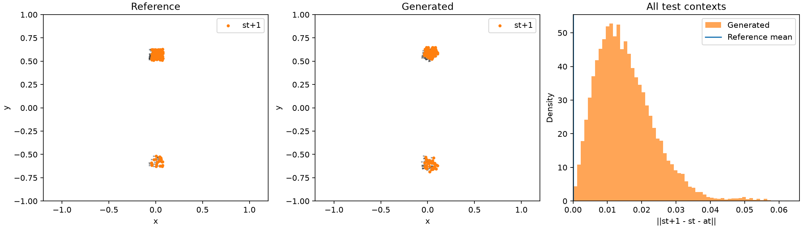

# Single-transition GAN results

G1 -> st; G2 -> at; G3 -> st+1. All three receive the same z and context. Joint D(st, at, st+1) supplies feedback. The marginal arm adds D(st), D(at), D(st+1), each conditioned on the observed context. Action is displacement.

Matched 28,000 updates, 14,336,000 real training draws, seed 24002. Public mog recipe with 1,024 particles, UCD and z_dim=32. Training draws, initial joint D/prior, normalization, source hashes and evaluation settings are matched. Generator initializations differ with architecture. No seed-only repeats.

Marginal critics add capacity and compute; only generator updates and real-data budgets are matched. Each critic has its own full-strength Rp/UCD/bcap objective. Generator feedback is L_joint + marginal_weight * mean(L_state, L_action, L_next), plus one prior regularizer. The joint critic's architecture is unchanged.

Lower SW1 and residual are better. Distances use frozen training normalization; residuals are in physical coordinates. Ranking is by aggregate held-out joint SW1.

| Model | G parameters | D parameters | Test joint SW1 | Interp. | Extrap. | State SW1 | Action SW1 | Next SW1 | Residual mean / p95 | Train seconds |
|---|---:|---:|---:|---:|---:|---:|---:|---:|---:|---:|
| branches_joint_marginals | 65,286 | 237,448 | 0.2500 | 0.2384 | 0.2848 | 0.2407 | 0.2364 | 0.2391 | 0.01486 / 0.02941 | 609.6 |
| branches_joint | 65,286 | 134,914 | 0.2550 | 0.2388 | 0.3035 | 0.2440 | 0.2417 | 0.2435 | 0.01529 / 0.03089 | 248.2 |
| monolithic_joint | 65,526 | 134,914 | 0.2622 | 0.2432 | 0.3191 | 0.2562 | 0.2513 | 0.2564 | 0.00519 / 0.01101 | 216.1 |

Real-vs-real floor: joint SW1 **0.0379**, residual **0**. Shuffling reference branches within context preserves all three empirical marginals but raises joint SW1 to **0.1513** and residual to **0.20478**. The mean reference displacement is **0.03656**, giving a physical scale for the residual.

| Model | Coverage | Precision | Spread ratio | Shuffled generated joint SW1 | Shuffled generated residual |
|---|---:|---:|---:|---:|---:|
| branches_joint_marginals | 0.262 | 0.240 | 1.178 | 0.3158 | 0.25289 |
| branches_joint | 0.266 | 0.230 | 1.136 | 0.3200 | 0.24236 |
| monolithic_joint | 0.115 | 0.113 | 1.196 | 0.3228 | 0.25233 |

Reference coverage/precision/spread: 0.954 / 0.948 / 1.015. Coverage is the fraction of reference points with a generated neighbor inside the reference's 95th-percentile nearest-neighbor radius; precision reverses the direction. This is a strict six-dimensional support check. Spread is total conditional normalized variance divided by reference variance, target 1.

## Interpretation

**branches_joint_marginals** has the lowest held-out joint SW1 in this comparison. Use residual and support coverage alongside that rank: good marginal distances or total variance do not establish a physically coherent transition.

For **branches_joint_marginals**, shuffling raises joint SW1 from 0.2500 to 0.3158 and residual from 0.01486 to 0.25289. The unshuffled residual is 40.6% of the mean reference step length. This ratio compares aggregate means, rather than averaging per-sample ratios.

For **branches_joint**, shuffling raises joint SW1 from 0.2550 to 0.3200 and residual from 0.01529 to 0.24236. The unshuffled residual is 41.8% of the mean reference step length. This ratio compares aggregate means, rather than averaging per-sample ratios.

For **monolithic_joint**, shuffling raises joint SW1 from 0.2622 to 0.3228 and residual from 0.00519 to 0.25233. The unshuffled residual is 14.2% of the mean reference step length. This ratio compares aggregate means, rather than averaging per-sample ratios.

Adding marginal critics to the same three generators changes held-out distances as follows (negative is better): joint_sw1: -0.0050, state_sw1: -0.0034, action_sw1: -0.0053, next_state_sw1: -0.0044, consistency_mean: -0.0004. This measures added marginal supervision and added critic compute together.

## Preference-class check

At the sampled time nearest the route midpoint, count states above the analytic centerline, averaged over held-out geometries. Class 0 should favor the upper side (target 0.8); class 1 should favor the lower side (upper target 0.3). This checks class-dependent mixture weights, not whether a generated point is on valid support.

| Model | Class 0 upper fraction | Class 1 upper fraction |
|---|---:|---:|
| branches_joint_marginals | 0.577 | 0.571 |
| branches_joint | 0.659 | 0.665 |
| monolithic_joint | 0.566 | 0.587 |
| Reference samples | 0.815 | 0.295 |

Similar generated frequencies across the two classes indicate weak use of the preference label, even if transition consistency is good.

**Weak class separation:** branches_joint_marginals, branches_joint, monolithic_joint. Their upper-side frequencies differ by less than 15 percentage points, versus the target's 50-point difference. A class-agnostic sampler can fit the pooled upper probability (0.55) while missing both conditional distributions.

This tests learning the joint transition distribution from complete records. It does not yet test missing-data recovery, benefit over marginal-only training, or arbitrary state/action queries and rollouts.

## Recommendation

Where the preference check fails, first compare explicitly feeding the class label into the critic against the current UCD class-head selection, holding the MoG, generator architecture and update budget fixed. This would test whether critic conditioning is responsible; the current results do not establish the cause.

Keep the better joint sampler as the reference. Next, add a marginal-only baseline to test the motivating claim that learning the whole helps a part; compare its per-block distances and shuffled controls under a matched total budget. Resolve the remaining marginal/support errors before interpreting added marginal critics or missing observations. A better total variance ratio alone is insufficient.

## Visuals

Plots can be regenerated from saved samples without retraining. The separate render provenance records display-code revisions; training source archives stay unchanged.

[branches_joint_marginals interactive viewer](branches_joint_marginals_viewer.html)

[branches_joint interactive viewer](branches_joint_viewer.html)

[monolithic_joint interactive viewer](monolithic_joint_viewer.html)

